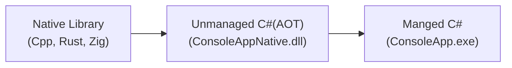

이전 글 [C# AOT 라이브러리 활용](https://devsight.kr/2026/03/22/1/)에서 `C++ constexpr`, `zig comptime`, rust의 매크로 함수인 `obfstr!` 함수를 이용하여 컴파일 타임에 문자열을 난독화하는 예제를 소개했는데 이번 글에서 Native 컴파일 언어로 각각 구현하였다.

CppNative.dll , rust_native.dll , zig_native.dll (Zig는 0.16dev 버전)



##### 개발 환경

* Cpp : [Clion](https://www.jetbrains.com/clion/) + 툴체인(Visusql Studio 2022)
* Rust : [RustRover](https://www.jetbrains.com/rust/) + rust 1.94.1
* Zig : [VSCode](https://code.visualstudio.com/) + zig 0.16.0-dev.3133+5ec8e45f3
* C\# : [Rider](https://www.jetbrains.com/rider/) + .net 10

전체 예제는 [Github](https://github.com/DebugJO/HelloWorldSample/tree/master/CSharp/AOT_Native_Project)에서 볼 수 있다.

#### CPP Example

##### 1. Cpp : CMakeList.txt

```bash
cmake_minimum_required(VERSION 4.2)  
project(CppNative)  
set(CMAKE_CXX_STANDARD 20)  
  
add_compile_options(/utf-8)  
# 정적 컴파일  
set(CMAKE_MSVC_RUNTIME_LIBRARY "MultiThreaded$<$<CONFIG:Debug>:Debug>")  
# 동적 컴파일 : dumpbin /dependents CppNative.dll 확인  
# set(CMAKE_MSVC_RUNTIME_LIBRARY "MultiThreaded$<$<CONFIG:Debug>:Debug>DLL")  
add_library(CppNative SHARED  
        library.cpp  
)  
set_target_properties(CppNative PROPERTIES OUTPUT_NAME "CppNative" PREFIX "")  
  
# 동적 컴파일 시 사용  
#if (CMAKE_BUILD_TYPE STREQUAL "Debug")  
#    set(CMAKE_INSTALL_DEBUG_LIBRARIES ON)  
#endif ()  
#include(InstallRequiredSystemLibraries)  
set(DEPLOY_DIR "${CMAKE_SOURCE_DIR}/deploy/$<CONFIG>")  
add_custom_command(TARGET CppNative POST_BUILD  
        COMMAND ${CMAKE_COMMAND} -E make_directory "${DEPLOY_DIR}"  
        COMMAND ${CMAKE_COMMAND} -E copy_if_different $<TARGET_FILE:CppNative> "${DEPLOY_DIR}"  
        # 동적 컴파일 시 사용  
        #COMMAND ${CMAKE_COMMAND} -E copy_if_different ${CMAKE_INSTALL_SYSTEM_RUNTIME_LIBS} "${DEPLOY_DIR}"  
        COMMENT "Deploying CppNative.dll and system dependencies to ${DEPLOY_DIR}"  
)
```

<!--more-->

##### 2. Cpp : library.h

```cpp
#pragma once  
#include <string>  
#include <array>  
  
template<size_t N>  
class ObfuscatedString {  
public:  
    template<size_t... Is>  
    constexpr ObfuscatedString(const char *str, char key, std::index_sequence<Is...>)  
        : m_key(key), m_data{static_cast<char>(str[Is] ^ key)...} {  
    }  
  
    [[nodiscard]] std::string decrypt() const {  
        std::string result;  
        result.reserve(N);  
        for (size_t i = 0; i < N; ++i) {  
            result += static_cast<char>(m_data[i] ^ m_key);  
        }  
        return result;  
    }  
  
private:  
    char m_key;  
    std::array<char, N> m_data;  
};  
  
#define OBFUSCATE(str) ([]() { \  
    constexpr size_t _len = sizeof(str); \  
    return ObfuscatedString<_len>(str, 0x5A, std::make_index_sequence<_len>{}); \  
}())  
  
#if defined(_WIN32)  
#define MY_API __declspec(dllexport)  
#else  
#define MY_API __attribute__((visibility("default")))  
#endif  
  
extern "C" {  
MY_API int GetSecretData(char *buffer, int obfuscatedKey);  
}
```

##### 3. Cpp : library.cpp

```cpp
#include "library.h"  
#include <iostream>  
  
#define FIXED_BUFFER_SIZE 1024  
#define SALT 0x1234  
#define VALID_KEY 0x7777  
  
int GetSecretData(char *buffer, const int obfuscatedKey) {  
    if ((obfuscatedKey ^ SALT) != VALID_KEY) {  
        return -1;  
    }  
  
    static ObfuscatedString<sizeof ("cpp 보안 문자열")> secret = OBFUSCATE("cpp 보안 문자열");  
    const std::string decrypted = secret.decrypt();  
  
    if (buffer != nullptr) {  
        const size_t len = (decrypted.length() < FIXED_BUFFER_SIZE) ? decrypted.length() : FIXED_BUFFER_SIZE - 1;  
        memcpy(buffer, decrypted.c_str(), len);  
        buffer[len] = '\0';  
        return static_cast<int>(len);  
    }  
    return 0;  
}
```

#### RUST Example

##### 1. Rust : Cargo.toml

```toml
[package]  
name = "rust_native"  
version = "0.1.0"  
edition = "2024"  
  
[lib]  
crate-type = ["cdylib"]  
  
[dependencies]  
obfstr = "0.4.4"  
  
[profile.release]  
opt-level = "z"   # 크기 최적화 (s 또는 z)
lto = true        # 전체 프로그램 최적화  
codegen-units = 1 # 최적화 품질 향상  
panic = "abort"   # 예외 발생 시 즉시 종료 (FFI 안전성)
```

##### 2. Rust : config.toml

```bash
[target.x86_64-pc-windows-msvc]  
rustflags = ["-C", "target-feature=+crt-static"]  
  
[target.i686-pc-windows-msvc]  
rustflags = ["-C", "target-feature=+crt-static"]
```

##### 3. Rust : lib.rs

```rust
use obfstr::obfbytes;  
use std::ptr;  
  
const SALT: i32 = 0x1234;  
const VALID_KEY: i32 = 0x7777;  
const MAX_INTERNAL_BUFFER: usize = 1024;  
  
#[unsafe(no_mangle)]  
pub extern "C" fn get_secret_data(buffer: *mut u8, buffer_len: i32, obfuscated_key: i32) -> i32 {  
    if buffer.is_null() || buffer_len <= 0 {  
        return 0;  
    }  
  
    if (obfuscated_key ^ SALT) != VALID_KEY {  
        return -1;  
    }  
  
    let bytes: &[u8; 21] = obfbytes!("rust 보안 문자열".as_bytes());  
    let safe_limit: usize = (buffer_len as usize).min(MAX_INTERNAL_BUFFER);  
    let copy_len: usize = bytes.len().min(safe_limit - 1);  
  
    unsafe {  
        ptr::copy_nonoverlapping(bytes.as_ptr(), buffer, copy_len);  
        ptr::write(buffer.add(copy_len), 0);  
    }  
  
    copy_len as i32  
}  
  
#[cfg(test)]  
mod tests {  
    #[test]  
    fn check_string_len() {  
        let s: &str = "rust 보안 문자열";  
        println!("바이트 길이: {}", s.len());  
        //assert_eq!(s.len(), 21);  
    }  
}  
  
// cargo test -- --nocapture  
// cargo build --release
```

#### ZIG Example

##### 1. Zig : build.zig

```zig
const std = @import("std");

pub fn build(b: *std.Build) void {
    const target = b.standardTargetOptions(.{});
    const optimize = b.standardOptimizeOption(.{});

    const lib = b.addLibrary(.{
        .name = "zig_native",
        .linkage = .dynamic,
        .root_module = b.createModule(.{
            .root_source_file = b.path("src/main.zig"),
            .target = target,
            .optimize = optimize,
        }),
    });

    b.installArtifact(lib);
}

// zig build -Doptimize=ReleaseSmall
```

##### 2. Zig : main.zig

```zig
const std = @import("std");

const SALT: i32 = 0x1234;
const VALID_KEY: i32 = 0x7777;
const XOR_KEY: u8 = 0x5A;
const MAX_INTERNAL_BUFFER: usize = 1024;

fn obfuscate(comptime str: []const u8) [str.len]u8 {
    var res: [str.len]u8 = undefined;
    for (str, 0..) |c, i| {
        res[i] = c ^ XOR_KEY;
    }
    return res;
}

const secret_data = obfuscate("zig 보안 문자열");

export fn get_secret_data(buffer: [*]u8, buffer_len: i32, obfuscated_key: i32) callconv(.c) i32 {
    if (buffer_len <= 0) {
        return 0;
    }

    if ((obfuscated_key ^ SALT) != VALID_KEY) {
        return -1;
    }

    const safe_limit = @as(usize, @intCast(buffer_len));

    const internal_limit =
        if (safe_limit < MAX_INTERNAL_BUFFER)
            safe_limit
        else
            MAX_INTERNAL_BUFFER;

    const copy_len =
        if (secret_data.len < internal_limit)
            secret_data.len
        else
            internal_limit - 1;

    var i: usize = 0;

    while (i < copy_len) : (i += 1) {
        buffer[i] = secret_data[i] ^ XOR_KEY;
    }

    buffer[copy_len] = 0;
    return @as(i32, @intCast(copy_len));
}
```

#### C\# Example

##### 1. C\# : ConsoleApp.csproj

```xml
<Project Sdk="Microsoft.NET.Sdk">  
    <PropertyGroup>  
        <OutputType>Exe</OutputType>  
        <TargetFramework>net10.0</TargetFramework>  
        <PublishSingleFile>true</PublishSingleFile>  
        <SelfContained>true</SelfContained>  
        <RuntimeIdentifier>win-x64</RuntimeIdentifier>  
        <ImplicitUsings>disable</ImplicitUsings>  
        <Nullable>enable</Nullable>  
        <AllowUnsafeBlocks>true</AllowUnsafeBlocks>  
        <ApplicationIcon>main.ico</ApplicationIcon>  
        <Version>1.0.0</Version>  
        <Copyright>Copyright © 2026 devsight.kr</Copyright>  
        <!-- 복사 충돌 시 -->  
        <!-- <ErrorOnDuplicatePublishOutputFiles>false</ErrorOnDuplicatePublishOutputFiles> -->    </PropertyGroup>  
  
    <!-- managed 라이브러리 PublishSingleFile 빌드할 때 EXE에 포함하지 않음 -->  
    <ItemGroup>  
        <ProjectReference Include="..\ConsoleAppLib\ConsoleAppLib.csproj">  
            <ExcludeFromSingleFile>true</ExcludeFromSingleFile>  
        </ProjectReference>  
    </ItemGroup>  
  
    <!-- AOT 라이브러리 빌드 -->  
    <ItemGroup>  
        <ProjectReference Include="..\ConsoleAppNative\ConsoleAppNative.csproj" ReferenceOutputAssembly="false">  
            <ExcludeFromSingleFile>true</ExcludeFromSingleFile>  
        </ProjectReference>  
    </ItemGroup>  
  
    <PropertyGroup>  
        <AotDllSourcePath>..\ConsoleAppNative\bin\$(Configuration)\$(TargetFramework)\win-x64\publish\ConsoleAppNative.dll</AotDllSourcePath>  
    </PropertyGroup>  
  
    <Target Name="PublishNativeAotLibrary" BeforeTargets="BeforeBuild;ComputeFilesToPublish">  
        <Message Importance="High" Text="[AOT 빌드 시작] ConsoleAppNative 프로젝트를 네이티브 DLL로 게시(Publish) 중..."/>  
        <Exec Command="dotnet publish &quot;..\ConsoleAppNative\ConsoleAppNative.csproj&quot; -c $(Configuration) -r win-x64"              StdOutEncoding="utf-8" StdErrEncoding="utf-8"/>  
    </Target>  
  
    <Target Name="CopyAotDllForBuild" AfterTargets="PublishNativeAotLibrary" Condition="'$(PublishProtocol)' == ''">  
        <Message Importance="High" Text="[빌드 모드] 생성된 네이티브 DLL을 출력 폴더로 복사합니다."/>  
        <Copy SourceFiles="$(AotDllSourcePath)" DestinationFolder="$(OutDir)" SkipUnchangedFiles="true"/>  
    </Target>  
  
    <Target Name="ExcludeAotDllFromSingleFile" AfterTargets="PublishNativeAotLibrary" BeforeTargets="ComputeFilesToPublish">  
        <Message Importance="High" Text="[배포 모드] 네이티브 DLL을 단일 파일에서 제외하고 외부 배포 목록에 추가합니다."/>  
        <ItemGroup>  
            <ResolvedFileToPublish Include="$(AotDllSourcePath)">  
                <RelativePath>ConsoleAppNative.dll</RelativePath>  
                <CopyToPublishDirectory>PreserveNewest</CopyToPublishDirectory>  
                <ExcludeFromSingleFile>true</ExcludeFromSingleFile>  
            </ResolvedFileToPublish>  
        </ItemGroup>  
    </Target>  
  
    <ItemGroup>  
        <None Remove="main.ico"/>  
        <Resource Include="main.ico"/>  
    </ItemGroup>  
  
    <!-- 메인(ConsoleApp)프로젝트에 이미 포함되어 있을 때 -->  
    <ItemGroup>  
         <None Update="CppNative.dll">  
             <CopyToOutputDirectory>Always</CopyToOutputDirectory>  
             <ExcludeFromSingleFile>true</ExcludeFromSingleFile>  
         </None>  
        <None Update="rust_native.dll">  
            <CopyToOutputDirectory>Always</CopyToOutputDirectory>  
            <ExcludeFromSingleFile>true</ExcludeFromSingleFile>  
        </None>  
        <None Update="zig_native.dll">  
            <CopyToOutputDirectory>Always</CopyToOutputDirectory>  
            <ExcludeFromSingleFile>true</ExcludeFromSingleFile>  
        </None>  
         <!--  
        <None Update="Database\test.db">
            <CopyToOutputDirectory>Always</CopyToOutputDirectory>
        </None>
        -->
    </ItemGroup>  
</Project>
```

```bash
# 싱글 파일 배포
dotnet publish -c Release : csproj에서 설정한 경우
dotnet publish -c Release -r win-x64 --self-contained true -p:PublishSingleFile=true  
```

C\#에 사용된 전체 예제는 [Github](https://github.com/DebugJO/HelloWorldSample/tree/master/CSharp/AOT_Native_Project)에서 확인할 수 있다. 폴더명은 csProject / ConsoleProject / 3개 프로젝트.

참고로 Zig 컴파일러는 아직 정식 버전으로 확정하기 전이므로 버전별로 호환에 문제가 발생할 수 있다.
